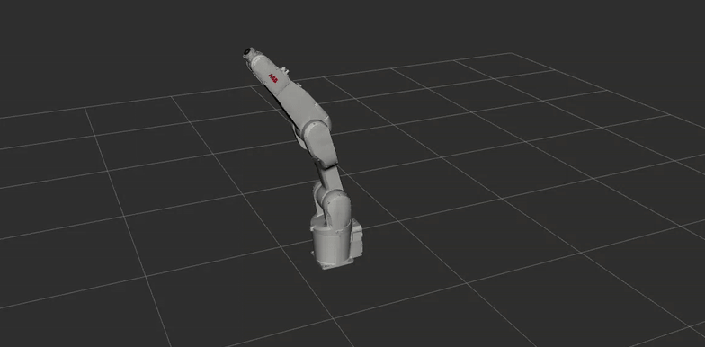
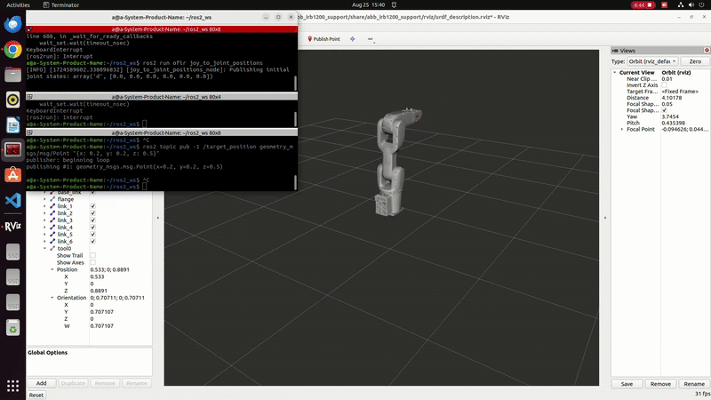

# 🤖 ABB IRB 1200 Robotic Arm – Final Project (Simulation & Real Robot Control)

This project focuses on developing and deploying an automated robotic food-serving system using the **ABB IRB 1200** robotic arm. The work progressed from simulation and motion planning to real-time control of the physical robot using multiple communication protocols.

---
## Requirements

## 🔧 Phase 1: RViz Simulation with ROS 2

The first stage of the project involved controlling the ABB IRB 1200 in a simulated environment using **RViz** and **ROS 2**. Key features:
- Used [PickNik’s `abb_ros2` package](https://github.com/PickNikRobotics/abb_ros2) to implement joystick-based motion control in RViz .

- Used inverse kinematics to validate robot behavior.


  
### INSTRUCTIONS

For running RViz, make sure you're first following [BUILDING THE PACKAGE IN ROS2 GUIDE](https://github.com/ofirdva/abb_ros2/blob/rolling/docs/README.md)
After Rviz is launched, run the following nodes for controlling the simulation with the joystick.
```bash
ros2 run <name_of_folder> joy
ros2 run <name_of_folder> joy_rely
ros2 run <name_of_folder> joy_to_joint_positions
```


---

## 🧩 Phase 2: Real Robot Control via Communication Protocols

After simulation, the next step was to control the actual robot. This required investigating multiple protocols to find the most suitable method for reliable operation.

### ✅ Robot Web Services (RWS) via ROS 2
- Used [PickNik’s `abb_ros2` package](https://github.com/PickNikRobotics/abb_ros2) to send RWS commands from Python.
- Successfully controlled motors, operation mode, and robot state monitoring.
- Limited to basic command execution — not real-time motion.

### ❌ Externally Guided Motion (EGM)
- Attempted to implement real-time joint control using UDP-based EGM.
- Tried both through ROS 2 and directly via standalone Python.
- Encountered persistent execution errors (e.g., **40223** on irc5). EGM was ultimately not viable for this setup.

### ✅ TCP/IP Communication (Final Approach)
- Implemented direct control using TCP/IP sockets.
- Sent both joint and Cartesian commands from Python, enabling full motion control.
- This solution proved most stable and effective for predefined and repeated tasks.

> 🔗 **TCP/IP Control Code adapted from:**  
> [`robotics/open_abb`]([https://github.com/milistu/open_abb]) – A Python interface for ABB robots over sockets.
### INSTRUCTIONS

For sending commands via TCP/IP, make sure you're first following [Robot Setup](https://github.com/ofirdva/automated-food-serving-project/blob/main/open_abb_sim/README.md)
```bash
python3
Import abb
R= abb.Robot(ip=’192.168.125.1’)
R.<name of function>
```

---

